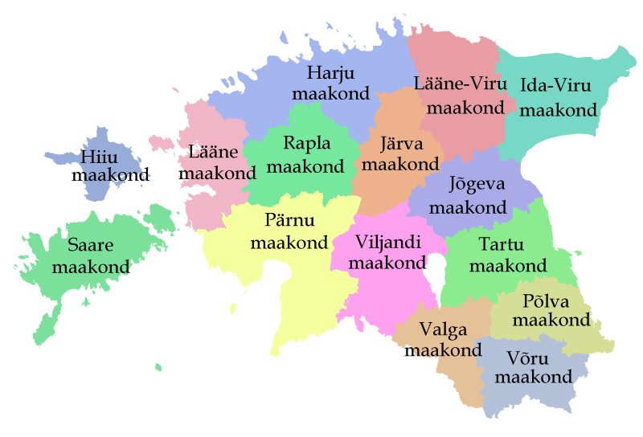
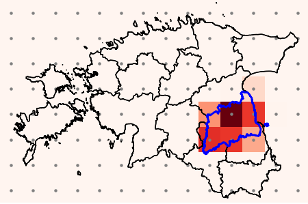

# Solar panels energy production forecasting ☀️

This repository contains the code for three distinct solutions developed for the [Enefit](https://www.kaggle.com/competitions/predict-energy-behavior-of-prosumers) Kaggle challenge.

Our approaches span from **LSTM networks** to **Transformer architectures**, culminating in an **ensemble model** that combines the strengths of each method.  
Our goal is to highlight the differences, strengths, and weaknesses of various architectures when tackling the same forecasting problem.

**Note:** This folder contains a refactored version of the original Kaggle notebook. As a result, replicating the experiments may require additional effort to write missing scripts and adjust file paths.

## 📖 Challenge Overview  
From the official page of the challenge:

> *The goal of the competition is to create an energy prediction model of prosumers to reduce energy imbalance costs.*
>
> *This competition aims to tackle the issue of energy imbalance, a situation where the energy expected to be used doesn't line up with the actual energy used or produced. Prosumers, who both consume and generate energy, contribute a large part of the energy imbalance. Despite being only a small part of all consumers, their unpredictable energy use causes logistical and financial problems for the energy companies.*

Solving this challenge will help improving energy managment, reducing waste and costs!

## 💾 Data  
The dataset used can be downloaded directly from the [challenge page](https://www.kaggle.com/competitions/predict-energy-behavior-of-prosumers/data). It consists of a CSV file that includes:  

🌍 Geographical information, a grid of coordinates for metheorological stations, zip code of customers...

🌤️ Weather data, snow on the ground, solar radiation, temperature... 

💰 Relevant energy prices  

☀️ Records of installed photovoltaic (PV) capacity

🕝 Accurate timestamp

The first thing we did was an extensive data analysis, producing some stats and plots about the data.
Some data showed a correlation with the targets. In particular, we present below some of the key results that emerged from our analysis:

  
  
  

## ⚙️ Feature Engineering

To enhance the predictive power of our models, we applied several preprocessing and feature engineering techniques:

**🌤️ Weather Data Grid**, the raw weather data was initially available on a grid of geographic points.  
We used **convex interpolation** to summarize this data on a **per-county** basis across Estonia, aligning it with administrative boundaries.  
This step was essential for capturing regional variations and aggregating data in a meaningful way.

  
  

**🔁 Scaling**, continuous features were standardized using **Z-score normalization** to ensure stable training behavior across all models.

**🏷️ Categorical Features**, categorical variables were processed using **One-Hot Encoding**, preserving their discrete nature while making them suitable for model input.

**🕝 Lag feature**, showed to increase the predictive power of the models.

## 🚀 Models
We implement three structurally different models to address this same challenge:

1️⃣ The first architecture is a classical **LSTM encoder-decoder**, that uses attention to produce the context.

2️⃣ The second model is a fairly simple **transformer that makes use of AdaLN-Zero and specialised attentions**: contract wise attention, county wise attention and time wise attention.

3️⃣ The third option "mixes" the previous: it employs a codebook for categorical data, a **transformer encoder with relative attention layers and a non-autoregressive LSTM decoder.**

You can find the code for each solution under 'src/enefit/models'.

## 📊 Results

We tested the three different models on the same test-set, evaluating each in terms of Mean Absolute Error (MAE) for both **production** and **consumption**.

| Model                     | Avg MAE | Prod. MAE | Cons. MAE | Params |
|--------------------------|---------|-----------|-----------|--------|
| **LSTM Encoder-Decoder**  | **95.01**  | 128.57    | **61.45**    | ~500K |
| **Specialized Transformer**   | **64.86**  | **72.24**    | **57.45**    | 3.2M   |
| **Hybrid Transformer-LSTM**     | 81.35   | 98.67     | 64.03     | 188K   |
| **Ensemble (LSTM + Transformer)**     | 63.5    | -         | -         | -      |

While the ensemble model slightly outperformed the specialized transformer (by 1.3 MAE points), it offered no substantial gain over the best individual solution.

### ✅ Summary

The specialized transformer (AdaLN-Zero with multi-context attention) consistently delivered the best performance across all metrics, showing how a well-structured transformer can outperform classical recurrent models even on structured tabular time series data.

## 📚 Resources

Our first approach follows the [paper](https://www.sciencedirect.com/science/article/pii/S0925231220300606), Shengdong Du, et al.

Our second approach implements [paper](https://arxiv.org/abs/2212.09748)

While our third is based on [paper](https://arxiv.org/abs/1803.02155), P. Shaw, et al.

