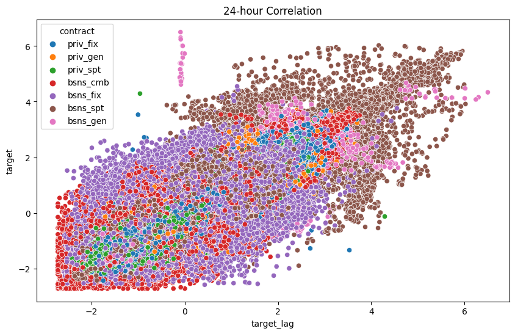
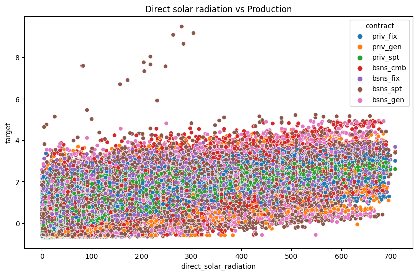
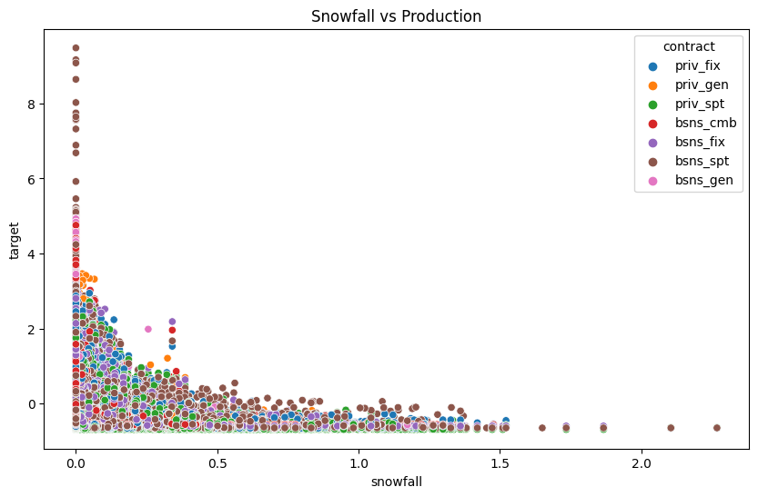

# Solar panels energy production forecasting ☀️

This folder contains three distinct solutions developed for the [Enifit](https://www.kaggle.com/competitions/predict-energy-behavior-of-prosumers) Kaggle challenge.

Our approaches span from **LSTM networks** to **Transformer architectures**, culminating in an **ensemble model** that combines the strengths of each method.  
Our goal is to highlight the differences, strengths, and weaknesses of various architectures when tackling the same forecasting problem.

**Note:** This folder contains a refactored version of the original Kaggle notebook. As a result, replicating the experiments may require additional effort to write missing scripts and adjust file paths. Nonetheless, we believe that open-sourcing the project and sharing our results could still be valuable and helpful to others.

## 📖 Challenge Overview  
> *The goal of the competition is to create an energy prediction model of prosumers to reduce energy imbalance costs.*
>
> *This competition aims to tackle the issue of energy imbalance, a situation where the energy expected to be used doesn't line up with the actual energy used or produced. Prosumers, who both consume and generate energy, contribute a large part of the energy imbalance. Despite being only a small part of all consumers, their unpredictable energy use causes logistical and financial problems for the energy companies.*

## 💾 Data  
The dataset used can be downloaded directly from the [challenge page](https://www.kaggle.com/competitions/predict-energy-behavior-of-prosumers/data). It consists of a CSV file that includes:  

🌍 Geographical information

🌤️ Weather data 

💰 Relevant energy prices  

☀️ Records of installed photovoltaic (PV) capacity

Some data show a correlation with the targets. In particular, we present below some of the key results that emerged from our analysis:

  
  
  

## ⚙️ Feature Engineering

To enhance the predictive power of our models, we applied several preprocessing and feature engineering techniques:

**🌤️ Weather Data Grid**, the raw weather data was initially available on a grid of geographic points.  
We used **convex interpolation** to summarize this data on a **per-county** basis across Estonia, aligning it with administrative boundaries.  
This step was essential for capturing regional variations and aggregating data in a meaningful way.

  
  

**🔁 Scaling**, continuous features were standardized using **Z-score normalization** to ensure stable training behavior across all models.

**🏷️ Categorical Features**, categorical variables were processed using **One-Hot Encoding**, preserving their discrete nature while making them suitable for model input.

## 🚀 Models
We implement three structurally different models to address this same challenge:

1️⃣ The first architecture is a classical **LSTM encoder-decoder**, that uses attention to produce the context.

2️⃣ The second model is a fairly simple **transformer that makes use of AdaLN-Zero and specialised attentions**: contract wise attention, county wise attention and time wise attention.

3️⃣ The third option "mixes" the previous: it employs a codebook for categorical data, a **transformer encoder with relative attention layers and a non-autoregressive LSTM decoder.**

### 📚 Resources

Our first approach follows the [paper](https://www.sciencedirect.com/science/article/pii/S0925231220300606), Shengdong Du, et al.

Our second approach implements [paper](https://arxiv.org/abs/2212.09748)

While our third is based on [paper](https://arxiv.org/abs/1803.02155), P. Shaw, et al.

